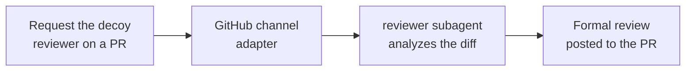

import { Callout } from 'fumadocs-ui/components/callout'

Wire the GitHub channel into your repo, request the agent as a reviewer on a pull request, and it runs a deep, line-anchored review through the bundled `reviewer` subagent and posts a formal GitHub review back. No human triggers it; the review request is the trigger.

<Callout type="info" title="This runs in production">
  
  [`@typeey`](https://github.com/typeey) — TypeClaw's own mascot agent — reviews pull requests on
  [`typeclaw/typeclaw`](https://github.com/typeclaw/typeclaw) exactly this way: request it as a reviewer, it spawns the
  `reviewer` subagent, posts a formal review. The recipe below is the setup behind that live example.
</Callout>

This recipe stitches together the GitHub channel adapter, the `reviewer` subagent, a public tunnel for the webhook, and — under GitHub App auth — the decoy-reviewer pattern. Each piece has its own page; this is the assembly.

## How it works

You request the reviewer; the agent does the rest. Under GitHub App auth you request a [decoy account](#set-up-the-decoy-reviewer) that stands in for the bot — that's what fires the webhook. The `reviewer` subagent then analyzes the diff and posts a formal review back to the PR.



The sections below set up each hop.

## Wire the GitHub channel

You don't hand-edit `typeclaw.json` for this. The operator must run the wizard at the host stage from inside the agent folder:

```sh
typeclaw channel add github
```

It walks the whole setup interactively:

- **Auth** — pick a fine-grained PAT or a GitHub App. It collects the token (or App ID + private key) and writes them to `secrets.json`, never to `typeclaw.json`.
- **Tunnel** — GitHub needs a public URL for webhooks. The wizard offers Cloudflare Quick Tunnel (no signup, recommended), a named tunnel, your own external URL, or none. Pick Quick and it provisions the tunnel for you.
- **Webhook port + secret** — defaults to `8975`; leave the secret blank and it auto-generates one.
- **Repos** — comma-separated `owner/repo` you want the agent to watch.

When it finishes, it **installs the repository webhooks for you** and enables the adapter. If the container is running, it offers to restart so the change takes effect; otherwise `typeclaw start` picks it up. See [Add a channel](/docs/guides/add-a-channel) for the shared flow and the [`github` adapter reference](/docs/reference/github) for the config the wizard writes.

Credential collection is host-only. An agent may explain the non-secret configuration, but it cannot collect a PAT or
private key conversationally or read the resulting secret store.

## Scope events to pull-request activity

The default GitHub event allowlist already covers reviews. If you want to narrow it to just the review path, the relevant events are `pull_request.review_requested`, `pull_request.review_request_removed`, `pull_request_review.submitted`, and `pull_request_review_comment.created` — keep `review_request_removed` so the agent still sees when a review request is withdrawn. Tell the agent to tighten `channels.github.eventAllowlist`, or adjust it and run `typeclaw reload`. See the [`github` adapter reference](/docs/reference/github) for the full event list.

<Callout type="info" title="App auth and the Contents permission">
  On a **public** repo an App only needs **Pull requests: read/write** to read the diff and post reviews. On a
  **private** repo the agent also needs **Contents: read** — the runtime-owned exact-SHA review fetch (and any raw
  file-tree access) of a private repo fails with 403/404 without it; **Metadata: read** alone lets the App _see_ the
  repo but not read its files. Model-driven review, commenting, and triage do not require **Contents: write**, so keep
  that permission disabled for this recipe. If a finding needs a fix, a host-stage operator checks out the repository,
  makes the authenticated push, publishes the branch, and creates the pull request using host credentials. The wizard's
  permission note lists exactly what to enable.
</Callout>

<Callout type="warn" title="The preflight won't catch a missing Contents grant">
  TypeClaw's App permission preflight only checks permissions tied to your configured `eventAllowlist` (issues, pull
  requests, discussions), so a private-repo reviewer missing **Contents: read** passes preflight cleanly and then fails
  at runtime when the reviewer action fetches or reads files. If reviews on a private repo error with "Resource not
  accessible by integration," add **Contents: read** to the App.
</Callout>

## Set up the decoy reviewer

This is the step everyone misses under App auth. **A GitHub App cannot be added as a pull-request reviewer.** The `requested_reviewer` field on a `pull_request.review_requested` webhook only ever holds a real **user** account; the App actor `slug[bot]` is not one, so GitHub never emits a review request targeting an App. The same is true for assignees and `@`-mentions.

The fix is a **decoy user account that impersonates the App** — same display name, same avatar — that you request as the reviewer instead. By convention the decoy is named after the App's slug:

| App slug | Bot actor (posts comments) | Decoy user (you request this) |
| -------- | -------------------------- | ----------------------------- |
| `my-app` | `my-app[bot]`              | `my-app`                      |

So for an App whose bot actor is `my-app[bot]`, create a real GitHub user account with the login **`my-app`** and request **`my-app`** as the reviewer on any PR you want looked at. The adapter derives the decoy login by stripping `[bot]` from its own actor and matches the incoming `requested_reviewer.login` against it. Comments still post from the App identity, so the visible reviewer stays consistent.

This is exactly how `@typeey` works: the App's bot actor is `typeey[bot]`, so the decoy account is the real user [`@typeey`](https://github.com/typeey). Requesting `@typeey` on a PR is what wakes the agent.

<Callout type="warn" title="The decoy is the only review trigger">
  Requesting the decoy (or the bot's team) is the **only** thing that fires a review under App auth. There is no "review
  every opened PR" behavior — a `pull_request.opened` event lands as awareness-only context. The wake path is
  `review_requested`, not the assignee `assigned` field.
</Callout>

<Callout type="info" title="When the slug login was taken">
  The decoy-login derivation assumes the decoy account's login equals the App slug. If that username was unavailable and
  you registered `my-app-bot` / `myapp` / etc., see
  [/internals/github-decoy-reviewer](/docs/internals/github-decoy-reviewer) for the single seam where the login is
  computed.
</Callout>

A **PAT-backed** bot needs none of this: it's already a real user you can request by its exact login. Skip straight to the next section.

## The review runs

When the decoy is requested, the agent wakes and delegates the analysis to the bundled **`reviewer`** subagent — read-only tools, a `deep` model profile, and a 5-minute timeout. It's the right delegation target here: `explorer` runs on a fast model and stays shallow, and `operator` needs elevated permissions a public GitHub session doesn't have. The reviewer returns line-anchored findings the agent turns into a review payload. See [/reference/bundled-plugins](/docs/reference/bundled-plugins) for the subagent inventory.

You don't script any of this. The review request lands, the agent reads the diff, spawns the reviewer, and posts back on its own — the same loop `@typeey` runs on every requested PR.

## How the review gets posted

Conversational comments go back through the channel automatically. A **formal review** — approve, request-changes, or inline line comments — is submitted through the first-class `post_github_review` tool. The adapter resolves the live PR head, validates each line anchor, moves out-of-diff findings into the review body, submits one review, and verifies the resulting review id and state. Formal verdicts share one process-wide coordinator with authenticated `gh` review commands, so concurrent per-PR submissions are serialized. An identical approval is deduplicated; when an identical changes-request is already effective, TypeClaw keeps that existing block authoritative and posts the new summary and findings as one PR conversation comment instead of creating another blocking review. TypeClaw credits the current-turn verdict ledger only from the verified effective state; policy-downgraded approvals and duplicate-review comment fallbacks count as output, never as approvals or new changes-request verdicts.

When a push re-opens a review the bot already blocked, the follow-up fans out one session per unresolved thread and designates a single carrier eligible to submit that round's verdict, so siblings draining in parallel cannot land conflicting verdicts. The carrier may post one same-state `REQUEST_CHANGES` for the new head — the duplicate rule that would normally downgrade it to a comment is lifted for exactly that case, since otherwise a "concerns remain" re-review could never conclude. With `review.approve: false` the carrier dismisses its prior blocking review rather than posting a `COMMENT`, which does not clear a block. Resolving a thread is never gated on carriership — only on GitHub's authoritative review state — so a thread whose concern is addressed still closes out once the block is gone or the round's verdict has landed.

The model should not inspect credential files or construct a direct REST or GraphQL `gh api` formal-review request.
Review-producing GraphQL mutations are denied before token minting. The guard inspects the shell-normalized `query`
field, including adjacent quoted fragments, so they cannot bypass the coordinator and verified ledger. If submission
fails, inspect the `post_github_review` result and adapter logs: they distinguish invalid anchors, permission denial,
stale/transient GitHub responses, and operator policy that downgraded an approval to a comment.

## Lock down who can trigger it

Inbound GitHub authors resolve to a role like any other channel. Keep public participants on `guest` with just `channel.respond`, and reserve privileged model-driven actions such as scheduling cron for `owner`. Repository checkout, authenticated push, branch publication, and pull-request creation remain host-stage operator actions regardless of role. To pair yourself as `owner`, run `typeclaw role claim --as owner` and follow the prompt — or, if you're already paired, ask the agent to grant a role via its `grant_role` tool from the TUI or a DM. The review path itself only needs read access plus the ability to post, so a stranger requesting the decoy gets a review but cannot trigger privileged model actions or host-stage repository publication. See [/concepts/permissions-model](/docs/concepts/permissions-model) for why provenance is enforced at the tool boundary.

---

Next: [Schedule a job](/docs/guides/first-cron) — pair the reviewer with a cron prompt to groom issues or summarize PR activity on a schedule.
